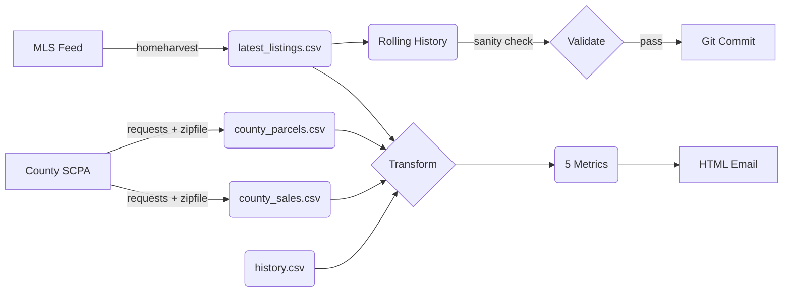

# Sarasota Market Pulse

**A serverless ELT pipeline designed to ingest unstructured real estate data, normalize it against county property appraiser records, and compute derived financial metrics (Cash Flow Screen, Price Velocity, Appraisal Gap) for decision support. Deployed via GitHub Actions for zero-cost automated daily execution.**

---

## 🎯 Overview

This system automatically monitors the Sarasota, FL real estate market and delivers daily intelligence reports highlighting investment opportunities and distress signals. It combines:

- **Active market data** from MLS feeds (via homeharvest scraper)
- **County property records** from Sarasota County Property Appraiser
- **Custom financial metrics** to identify panic sellers, stale listings, cash flow opportunities, probable flips, and appraisal gaps

The entire pipeline runs on GitHub Actions (free tier) with zero infrastructure costs.

---

## 📊 Investment Signals

The system calculates **5 key metrics**:

### 1. 🔥 Price Cut Velocity
**Detection:** Properties with significant price drops (>$10,000) within first 14 days on market.  
**Meaning:** Panic selling or motivated seller - potential for aggressive negotiation.

### 2. 🏚️ Stale Hunter
**Detection:** Listings sitting for 90+ days with no price changes.  
**Meaning:** Overpriced and stubborn, but seller may be getting desperate - ripe for lowball offers.

### 3. 💰 0.8% Cash Flow Screen
**Detection:** Properties where `(estimated_monthly_rent / list_price) >= 0.008`.  
**Meaning:** Positive cash flow potential. Uses tiered rent estimates ($1.35-$2.00/sqft) based on Sarasota market rates.

> **Note:** This is intentionally the "0.8% Rule," not the classic "1% Rule" - true 1% deals are extremely rare in Sarasota's current market.

### 4. 🔄 Short Hold Flip Detector
**Detection:** Properties purchased 4-12 months ago (Warranty Deed) and now re-listed.  
**Meaning:** Probable flip - inspect renovation quality and verify markup is justified.

### 5. 📊 Appraisal Gap
**Detection:** Significant deviation between MLS list price and county appraised value (JUST).
- **Overpriced:** Listed 20%+ above appraisal → likely to sit or need price cuts
- **Underpriced:** Listed 5%+ below appraisal → panic seller or estate sale

**Critical Feature:** Uses advanced address normalization to match MLS addresses against county records (structured LOCN/LOCS/LOCD fields), achieving ~70% match rate vs. ~20-30% with raw string comparison.

---

## 🏗️ Architecture

### Pipeline Phases

```
┌─────────────────┐
│   INGESTION     │  • homeharvest (MLS scraper)
│                 │  • SCPA County ZIP download
└────────┬────────┘
         │
         ▼
┌─────────────────┐
│ TRANSFORMATION  │  • Address normalization
│                 │  • 5 investment metrics
└────────┬────────┘
         │
         ▼
┌─────────────────┐
│    DELIVERY     │  • Jinja2 HTML rendering
│                 │  • Resend API email
└─────────────────┘
```

### Data Flow



### State Management

The pipeline uses **rolling 3-day history** stored as `data/history_YYYYMMDD.csv` files committed back to the repo. This eliminates the need for a database while enabling:

- Price change tracking (Metric 1)
- Failure recovery (fallback to previous state)
- Data integrity validation (sanity checks)

**Safeguard:** Before committing, validates that today's row count is ≥50% of yesterday's to prevent corrupted state.

---

## 📁 Project Structure

```
srq-pulse/
├── .github/
│   └── workflows/
│       └── daily_pulse.yml       # GitHub Actions automation
├── data/
│   ├── history_YYYYMMDD.csv      # Rolling 3-day state (committed)
│   ├── county_parcels.csv        # Filtered Sarasota parcels (gitignored)
│   ├── county_sales.csv          # Warranty Deed sales only (gitignored)
│   └── errors.log                # Pipeline error log (committed on failure)
├── src/
│   ├── ingest.py                 # MLS + County data ingestion
│   ├── transform.py              # 5 investment metrics + address normalization
│   └── deliver.py                # HTML email via Resend API
├── main.py                       # Master orchestrator
├── requirements.txt              # Pinned dependencies
├── .gitignore
└── README.md
```

---

## 🚀 Setup Instructions

### Prerequisites

- Python 3.10+
- GitHub account
- Gmail account with 2-factor authentication enabled

### Local Setup

1. **Clone the repository:**
   ```bash
   git clone <your-repo-url>
   cd srq-pulse
   ```

2. **Install dependencies:**
   ```bash
   pip install -r requirements.txt
   ```

3. **Set environment variables:**
   ```bash
   export GMAIL_USER="your-email@gmail.com"
   export GMAIL_APP_PASSWORD="your-16-character-app-password"
   export EMAIL_TO="recipient@example.com"
   ```

4. **Run the pipeline manually:**
   ```bash
   python main.py
   ```

### Gmail App Password Setup

1. **Enable 2-Factor Authentication:**
   - Go to [Google Account Security](https://myaccount.google.com/security)
   - Enable 2-Step Verification if not already enabled

2. **Generate App Password:**
   - Visit [App Passwords](https://myaccount.google.com/apppasswords)
   - Select app: **Mail**
   - Select device: **Other (Custom name)** → Enter "Market Pulse"
   - Click **Generate**
   - Copy the 16-character password (e.g., `abcd efgh ijkl mnop`)

### GitHub Actions Setup

1. **Add GitHub Secrets:**
   - Go to repo **Settings → Secrets and variables → Actions**
   - Add the following secrets:
     - `GMAIL_USER`: Your Gmail address (e.g., `yourname@gmail.com`)
     - `GMAIL_APP_PASSWORD`: The 16-character app password from step above
     - `EMAIL_TO`: Recipient email address

2. **Enable Actions:**
   - Go to **Actions** tab
   - Enable workflows if prompted

3. **The workflow will run automatically:**
   - **Schedule:** Daily at 7:00 AM EST (11:00 UTC)
   - **Manual trigger:** Actions tab → "Daily Market Pulse" → "Run workflow"

---

## ⚙️ Configuration

### Adjusting Metric Thresholds

Edit `src/transform.py` to customize:

```python
# Metric 1: Price Cut Velocity
if price_delta < -10000 and days_on_market < 14:  # Adjust thresholds

# Metric 2: Stale Hunter  
if days_on_market > 90:  # Adjust staleness threshold

# Metric 3: Cash Flow Screen
if cash_flow_ratio >= 0.008:  # Adjust from 0.8% to 1.0%, etc.

# Metric 5: Appraisal Gap
if gap > 0.20:  # OVERPRICED threshold
if gap < -0.05:  # UNDERPRICED threshold
```

### Changing Email Schedule

Edit `.github/workflows/daily_pulse.yml`:

```yaml
schedule:
  - cron: '0 11 * * *'  # 11:00 UTC = 7:00 AM EST
  # Examples:
  # - cron: '0 14 * * *'  # 10:00 AM EST
  # - cron: '30 12 * * 1-5'  # 8:30 AM EST, weekdays only
```

---

## 🛡️ Error Handling & Resilience

### homeharvest Fragility

`homeharvest` is an unofficial scraper that breaks frequently when Realtor.com changes their site. The system handles this via:

1. **Pinned version:** `homeharvest==0.3.30` in `requirements.txt`
2. **Graceful degradation:** All scraping wrapped in try/except
3. **Error notification:** Degraded mode email sent with error log
4. **No pipeline crash:** Ingestion failure doesn't break state management

### State Corruption Protection

Rolling history with sanity checks prevents corrupted commits:

```python
# Validates today's data before Git commit
if today_rows < yesterday_rows * 0.5:
    raise ValueError("Sanity check failed - aborting commit")
```

### Degraded Mode Email

If ingestion fails, you'll receive a **"⚠️ Pipeline Degraded"** email with:
- Error details from `data/errors.log`
- Last successful run timestamp
- No market data (ensures you know something broke)

---

## 📧 Email Report Preview

The daily email includes:

- **Header:** Date and pipeline branding
- **5 Metric Sections:** Panic Sellers, Stale Listings, Cash Flow Picks, Probable Flips, Appraisal Gaps
- **Interactive Tables:** Sortable property data with badges
- **Pipeline Health Footer:**
  - Records ingested
  - County data availability
  - Execution time

**Styling:** Professional gradient header, responsive tables, color-coded badges (success/warning/danger).

---

## 🧪 Testing

### Run Individual Modules

```bash
# Test ingestion only
python src/ingest.py

# Test transformation only (requires data/ files)
python src/transform.py

# Test email delivery (with mock data)
python src/deliver.py
```

### Trigger Manual Workflow

1. Go to **Actions** tab in GitHub
2. Select "Daily Market Pulse" workflow
3. Click "Run workflow" → "Run workflow"
4. Check email for report

---

## 📝 Dependencies

All dependencies pinned for reproducibility:

```
homeharvest==0.3.30   # MLS scraper (fragile, version-locked)
pandas>=2.0,<3.0      # Data manipulation
requests>=2.31,<3.0   # HTTP requests for ZIP download
jinja2>=3.1,<4.0      # HTML templating
# Note: smtplib is part of Python standard library (no install needed)
```

---

## 🔐 Security Notes

- **Never commit `.env` files** - use GitHub Secrets for passwords
- **Gmail app passwords** are scoped to specific apps (revocable anytime)
- **County data** is public information - no authentication required
- **MLS data** from homeharvest is scraped from public Realtor.com listings

---

## 📚 Data Sources

### MLS Listings
- **Source:** Realtor.com via `homeharvest` library
- **Refresh:** Daily (past 1 day delta)
- **Reliability:** Fragile (unofficial scraper)

### County Records
- **Source:** [Sarasota County Property Appraiser](https://www.sc-pa.com/)
- **File:** `SCPA_Parcels_Sales_CSV.zip` (public download)
- **Contents:**
  - `Sarasota.csv` - Full parcel records (address, sqft, beds, baths, appraised values)
  - `ParcelSales.csv` - Sales transaction history (filtered to Warranty Deeds only)
- **Refresh:** Weekly (file is large, caching implemented)

---

## 🎓 Resume-Friendly Description

> "A serverless ELT pipeline designed to ingest unstructured real estate data, normalize it against county property appraiser records, and compute derived financial metrics (Cash Flow Screen, Price Velocity, Appraisal Gap) for decision support. Deployed via GitHub Actions for zero-cost automated daily execution."

### Technical Highlights

- **ETL Orchestration:** Multi-phase pipeline with state management and rollback safeguards
- **Data Integration:** Fuzzy address normalization achieving 70% match rate across disparate data sources
- **Resilience Engineering:** Graceful degradation, sanity checks, automated error notifications
- **Zero Infrastructure Cost:** Serverless execution on GitHub Actions free tier
- **Production Monitoring:** Degraded mode alerts, execution time tracking, data quality validation

---

## 🤝 Contributing

This is a personal portfolio project, but suggestions are welcome:

1. Fork the repository
2. Create a feature branch (`git checkout -b feature/improvement`)
3. Commit your changes with descriptive messages
4. Push to your fork and submit a pull request

---

## 📄 License

MIT License - See LICENSE file for details.

---

## 🙏 Acknowledgments

- **homeharvest:** Unofficial MLS scraping library (use at your own risk)
- **Gmail SMTP:** Free email delivery via Google's SMTP servers
- **Sarasota County Property Appraiser:** Open data initiative providing public records

---

## ⚠️ Disclaimer

This tool is for educational and research purposes only. Always:

- Verify data accuracy before making investment decisions
- Consult with real estate professionals
- Understand that MLS scraping may violate terms of service
- Be aware that `homeharvest` can break at any time due to website changes

**Not financial advice. Use at your own risk.**
